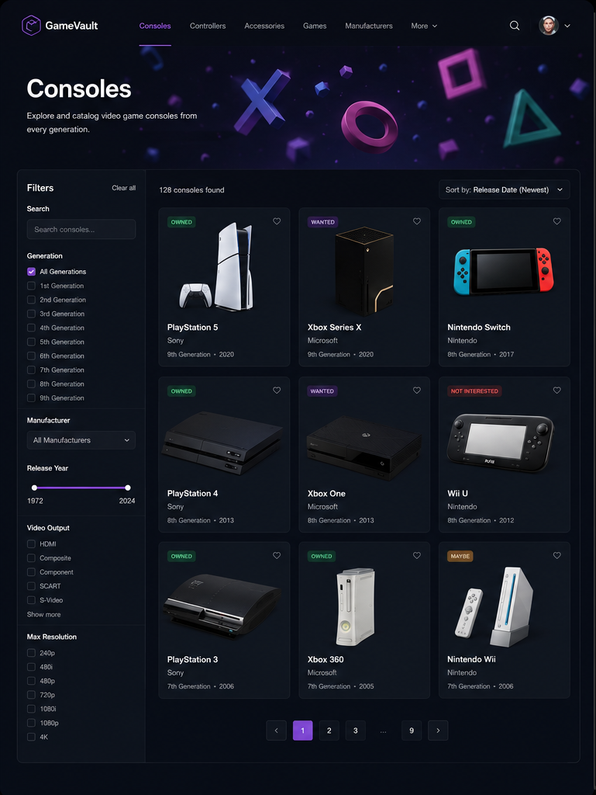
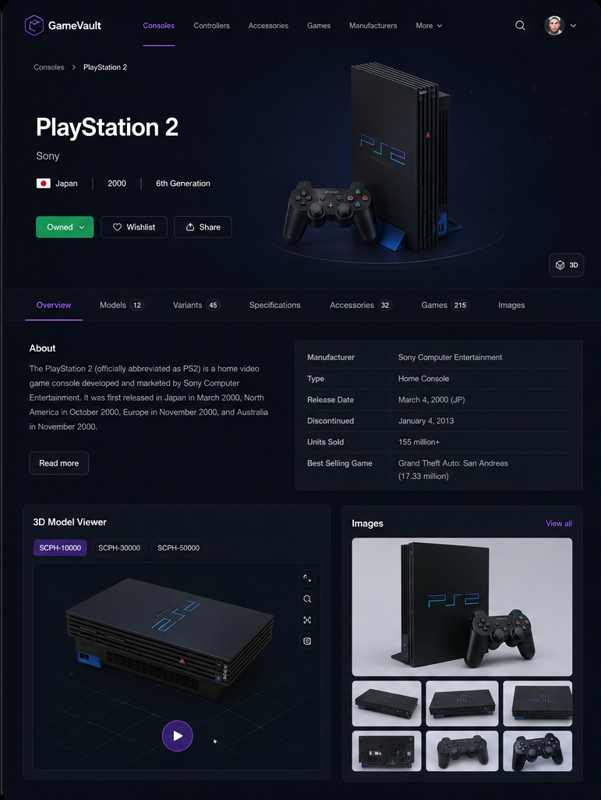
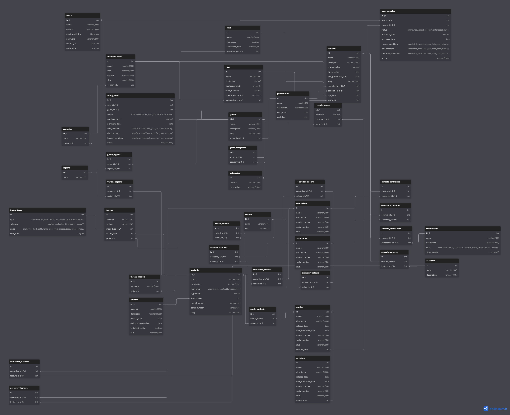

# Console Collection Website
(Check the item-collection branch for up-to-date code)

## Project details
This website is a fun and big project to act as a sort of console database, mostly for private use. I want to challenge myself to create something that looks nice and is easy to use. In addition, I just want a database that I can reference myself, without the clunkiness of a text-document or spreadsheet. The final version will only feature a few consoles, their accessories and information as to not create a gigantic repository.  
This website will not only feature consoles, but also their accessories like controllers, memory cards, games and eventually a user wishlist feature.  
The page will feature dynamic filters & pages, 3D models made by me, reusable components.  

For images and more detailed info about this project, scroll down further \ /.

### Tech stack
The page will be built using the following:
- Laravel (Backend)
- MySQL (Database)
- SCSS (Styling)
- Three.JS (3D OpenGL Models)
- Dat.GUI (Three.JS Debug menu)

## Website Design
The entire main design is made by myself. Disclaimer: AI was only used to add the specific console's images and the 3D PlayStation icons banner for better visualization of how the finalized page will look like.

### Main Page (Item page)
The main page and its design will be used for all the other pages as well (Controllers, Accessories, Games, etc.) with the use of reusable components.



#### 3D Model Banner
Starting from below the navigation bar, sits the 3D model banner. This banner uses Three.JS to render simple icons from a specific console family / manufacturer.  
The user will be able to toggle the 3D effects on / off with a button in the navigation bar. If turned off, it will display a static 2D image.  
For now, the chosen console family / manufacturer will be random at each page load, but a selection menu might be added in the future.  
  
Console families that will be able to be chosen randomly:
- Playstation Button Icons & PS1 Logo
- Xbox Logos (Including past, historic logos)
- Nintendo Logos (Including past, historic logos)
- Sega Logo & Sega Console Logos:
    - Vectrex
    - SG-1000
    - Master System
    - Genesis / Mega Drive
    - Saturn
    - Dreamcast
- Atari Logos (Including past, historic logos)

#### Filters
Below the 3D Banner and on the left is home to the filters section. Here, the user is able to filter the items between various settings:
- A dynamic search bar that search as the user is typing
- Console generation checkboxes (1st - 9th gen)
- Manufacturer dropdown (Might be changed to a multi-selection dropdown in the future)
- Release year dual-slider
- Video output:
    - RF
    - Composite
    - S-Video
    - Component
    - (RGB) SCART
- Max (supported) resolution (240p - 4K)
- Colour selection

#### Item Grid
The item grid will feature pagination (Only a maximum of 9 items will be loaded at a time for better performance). The more items are in the database, the more pages the user is able to traverse through.  
The items will feature an image, basic information like name, manufacturer, generation & release date. Eventually, the user will be able to select if they already own (green), want (purple), isn't sure (yellow) or isn't interested at all (red) in the item. A small coloured banner will be shown in the top-left corner.  
The amount of items found in the database is shown on the top-left of the section and another, single, dropdown filter will be shown on the right with filters like:
- Name (A-Z Asc. / Z-A Desc.)
- Manufacturer (A-Z Asc. / Z-A Desc.)
- Generation (1-9 Asc. / 9-1 Desc.)
- Release date (New Desc. / Old Asc.)
- Colour (A-z Asc. / Z-A. Desc.)

### Item Details page
This page will display all the related items information.  



The top section will feature a navigation bar to switch the page dynamically to view the items':
- Overview
- Models (Phat, Slim, Super Slim, etc.)
- Variants (Limited Editions, special variants, Dev-Kits, etc.)
- Specifications (Hardware)
- Supported Accessories
- Games
- Images

#### Item Header Banner
This section all the way on the top and below the navigation bar, will feature the items information (name, region, generation & release date), the 'owned' status and by default a 2D image of the item. If the user has 3D enabled via the navbar, the 2D image will become a rotating 3D model instead.  
The wishlist and share features might be added in the future.

#### Detailed item information section
The rest of the page will feature more detailed information about the selected item.  
On the top-left is a small about / trivia section. If the user clicks on 'Read more' a window will pop-up on the screen with more detailed information (the user will *not* be redirected to a new page).  
To the right of the About section shows more detailed and specific information of the item like:
- Manufacturer
- Type of item
- Release Date of that specific item (changes depending on item edition / variation)
- Item discontinuation date
- Units sold
- If it's a console: The best selling game  

The bottom-left of the page features a user interactable 3D model viewer for all the different revisions.  
The bottom-right houses the items' images. The user will be able to click on an image to enlarge it.

## Database Design
A website as big as this requires a big database. See the image for details. The design was made using the website: DBDiagram.



### Setup instructions
Download [Node.js](https://nodejs.org/en/download/) & an SQL server like [WampServer](https://wampserver.aviatechno.net).  
Run the following commands:

``` bash
# Install dependencies (only the first time):
npm install

# Create & Seed the local database via the terminal:
php artisan migrate --seed

# Run the local servers in two different terminals and open the site in browser at localhost:8000:
npm run dev
php artisan serve
```
npm run dev is for SASS support  
php artisan serve is for laravel  

If the page does not load, make sure WampServer, SASS terminal and the laravel terminal are running.